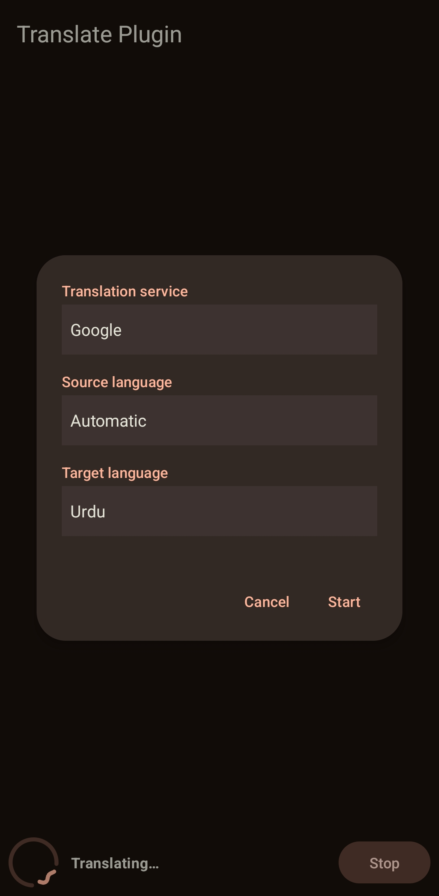
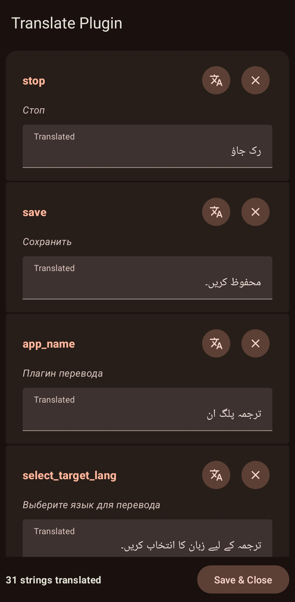

# Apk-Editor-Translate-Plugin

Translate Plugin for APK Editor Pro, Master, Ultra, UI, GO & GM

A lightweight and modern translation plugin designed for the APK Editor ecosystem.  
Built with a clean **Material 3 style interface**, the plugin focuses on speed, simplicity, and wide language coverage.

It allows developers and reverse engineers to translate application resources quickly using powerful translation APIs while keeping the workflow smooth inside APK Editor.

---

## Description

Apk-Editor-Translate-Plugin was created to simplify large scale string translations while working on APK projects.

The plugin supports nearly every language currently available through **Google Translate** and **Yandex Translate**, covering around **150+ languages** including modern **AI languages** supported by these services.

The focus of this plugin is simple.

Provide a clean, fast, and reliable translation experience that integrates naturally with APK Editor tools.

---

## Features

- 🌍 **150+ Supported Languages**  
  Includes all languages supported by Google Translate and Yandex Translate.

- ⚡ **High Speed Translation API**  
  Uses fast translation APIs for quick processing.

- 🤖 **AI Languages Support**  
  Includes languages supported through modern AI translation systems.

- 🎨 **Material 3 Design**  
  Clean and modern interface inspired by the latest Android design language.

- 🔌 **APK Editor Ecosystem Compatible**  
  Designed for APK Editor Pro, Master, Ultra, UI, GO, and GM.

- 🧩 **Lightweight Plugin**  
  Minimal overhead while working inside large projects.

---

## Screenshots

<p align="center">
  
  
</p>

---

## License

See the file below for full license information.

```
MIT License

Copyright (c) 2026 Ameer Muawiya

Permission is hereby granted, free of charge, to any person obtaining a copy
of this software and associated documentation files (the "Software"), to deal
in the Software without restriction, including without limitation the rights
to use, copy, modify, merge, publish, distribute, sublicense, and/or sell
copies of the Software, and to permit persons to whom the Software is
furnished to do so, subject to the following conditions:

The above copyright notice and this permission notice shall be included in all
copies or substantial portions of the Software.

THE SOFTWARE IS PROVIDED "AS IS", WITHOUT WARRANTY OF ANY KIND, EXPRESS OR
IMPLIED, INCLUDING BUT NOT LIMITED TO THE WARRANTIES OF MERCHANTABILITY,
FITNESS FOR A PARTICULAR PURPOSE AND NONINFRINGEMENT. IN NO EVENT SHALL THE
AUTHORS OR COPYRIGHT HOLDERS BE LIABLE FOR ANY CLAIM, DAMAGES OR OTHER
LIABILITY, WHETHER IN AN ACTION OF CONTRACT, TORT OR OTHERWISE, ARISING FROM,
OUT OF OR IN CONNECTION WITH THE SOFTWARE OR THE USE OR OTHER DEALINGS IN THE
SOFTWARE.
```

---

## Credit

Created by **Ameer Muawiya**

If you use this project, reuse parts of it, or distribute modified versions,  
please keep the original credit to respect the author's work.
